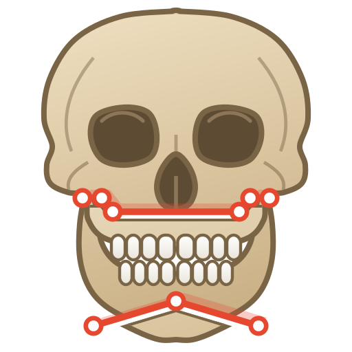
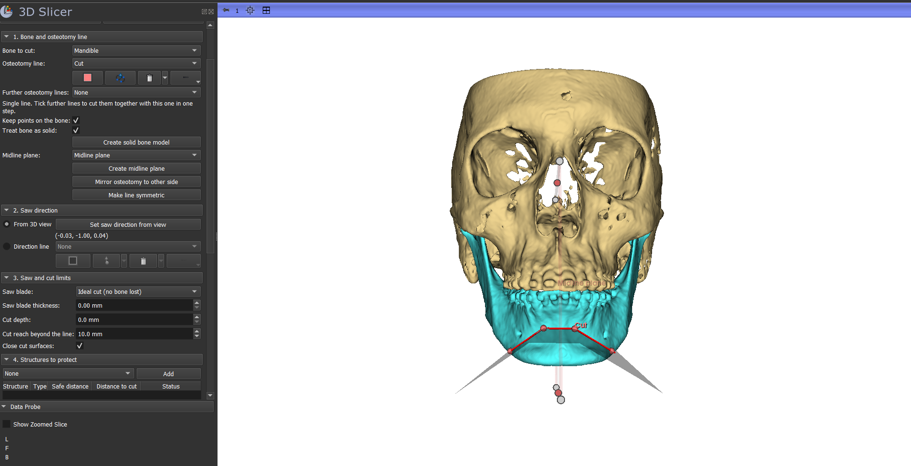
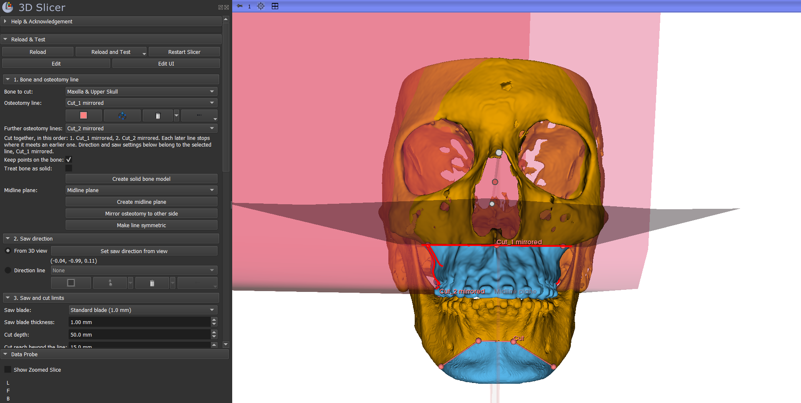
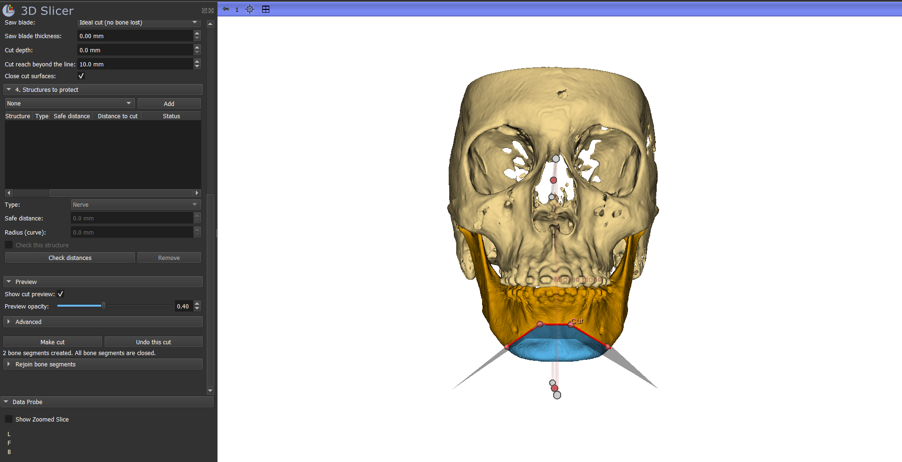

<p align="center"></p>

# Osteotomy Cuts

> **Important — research and planning software, not a medical device.** Use is entirely at the user's own risk. Safety checks are an aid only: they depend on the accuracy of the segmented or traced structures, do not guarantee the absence of risk, and do not replace the surgeon's own verification. See [DISCLAIMER.md](DISCLAIMER.md).

A [3D Slicer](https://www.slicer.org) extension for virtual osteotomies in orthognathic and craniofacial surgical planning. Draw an osteotomy line on the bone, set the saw direction, and the bone is divided into separate, closed bone segments — with multi-segment cuts such as a Le Fort I, not only a single flat plane. The original bone model is kept unchanged and hidden.



## Features

- **Osteotomy lines of any shape:** click points on the bone surface; each point adds a corner. The cut follows the line along the saw direction, taken from the 3D view or from a direction line.
- **Saw blade thickness and cut limits:** ideal cut, thin (0.5 mm) or standard (1.0 mm) blade or any thickness; a limited cut depth; and a cut reach beyond the line that stops the cut in a gap between bones.
- **Several lines in one osteotomy:** e.g. the horizontal and pterygomaxillary cuts of a Le Fort I in one step. Each later line stops where it meets an earlier one. Each line keeps its own saw direction and limits.
- **Symmetrical cuts:** mirror an osteotomy (e.g. the left BSSO) to the other side across a midline plane, with mirrored saw directions and the same settings, or make a line such as a genioplasty symmetric by drawing one half.
- **Closed bone segments:** the cut surfaces are closed, so the segments are watertight for 3D printing and volumes. Every segment is checked, and you are warned if one is not closed.
- **Solid bone models:** segmented bone often has holes and internal surfaces; *Create solid bone model* (or *Treat bone as solid*) seals holes and fills marrow and canals so that the bone divides cleanly.
- **Live preview:** the planned cut is shown as a red transparent surface, with red lines wherever it comes out of the bone.
- **Structures to protect:** add the nerve canal, tooth roots or other structures with a safe distance each. The distance from the cut is measured (allowing for the blade), the closest point is marked, the preview turns green, amber or red, and you are warned before cutting.
- **Provenance:** every bone segment records how it was made (lines, saw direction, blade, depth, solid settings, time, module version).
- **Undo and rejoin:** undo a whole osteotomy, or rejoin bone segments of the same cut.

## Requirements

Tested on 3D Slicer 5.12.4 (stable, revision 34645, built 2026-09-09) and 3D Slicer 5.13.0 (preview, revision 34833, built 2026-06-30), Windows 11. Not yet tested on macOS or Linux.

No other software is needed: VTK, NumPy and SciPy ship with 3D Slicer.

## Installation

- **From the Extensions Manager** (once published): in 3D Slicer, open *View → Extensions Manager*, search for **OsteotomyCuts**, install and restart Slicer.
- **From source:** clone this repository, then in Slicer open *Edit → Application Settings → Modules* and add the `OsteotomyCuts` folder of the repository to *Additional module paths*; restart Slicer.

The module appears under **Planning → Osteotomy Cuts**. On first use you are asked to accept the terms of use.

## Quick start

1. **Bone to cut:** select the bone model. For best results use *Create solid bone model* first, or keep *Treat bone as solid* ticked.
2. **Osteotomy line:** click points on the bone surface where you would mark the cut in theatre. Each point adds a corner.
3. **Saw direction:** rotate the 3D view to look along the direction you would hold the saw, then press *Set saw direction from view*. Or draw a direction line for a precise, reproducible angle.
4. **Check the preview:** the red transparent surface is the planned cut. The red lines show every place where the cut comes out of the bone.
5. **Make cut.** Use *Undo this cut* to remove it and try again.

If red lines appear where bone must stay intact (for example the skull base behind the maxilla), limit the cut with **Cut depth** and **Cut reach beyond the line**.

## Example: Le Fort I on a skull model

1. **Horizontal line:** place the osteotomy line from one zygomatic buttress, round the anterior maxilla, to the other, about 5 mm above the tooth apices. View the skull from the front and press *Set saw direction from view*. Set **Cut depth** to about 45–55 mm (to the pterygoid plates), **Cut reach beyond the line** to 5–10 mm and **Saw blade thickness** to 0.5–1.0 mm.
2. **Pterygomaxillary line:** create a second osteotomy line on the side of the maxilla behind the tuberosity, from the horizontal line downwards. View the skull from the side and set the saw direction (it cuts both sides). Leave the cut depth at *Through* and the reach at *Automatic*: it stops at the horizontal cut.
3. Select the horizontal line again and tick the second one under **Further osteotomy lines**. Check that the red lines stay on the maxilla, then press *Make cut*. Small loose pieces between the cuts are joined to the neighbouring bone segment.



## Symmetrical cuts

1. Press **Create midline plane** (section 1): a plane through the centre of the bone, facing left-right. Move and rotate it with its handles onto the true midline (e.g. through nasion, anterior nasal spine and menton).
2. **Mirror osteotomy to other side:** plan one side (e.g. the left BSSO, all its lines), then press the button. A mirrored copy with mirrored saw directions and the same blade and cut limits is created and selected; its points are put on the other side's bone surface, so it follows that side's own anatomy. Check it in the preview, then make the cut.
3. **Make line symmetric:** for a cut across the midline such as a genioplasty, draw the line from the midline to one side, then press the button: its mirror image is added on the other side and the saw direction is turned into the midline plane.



## Structures to protect

In **4. Structures to protect**, choose the nerve canal or tooth model (or a curve traced along a nerve, with its radius) and press *Add*. The type and usual safe distance (nerve 2 mm, tooth root 1 mm) come from the name and can be changed. The table shows the distance from the cut to each structure and its status (*Safe*, *Too close*, *Cut enters structure*); it is updated during the preview and checked again before every cut.

## Limitations

- A solid bone model is rebuilt from voxels: its surface moves by up to about half the solid model detail (0.1 mm at the default 0.25 mm), and gaps narrower than about twice the gap sealing (e.g. between teeth) are filled. The first cut of a bone takes several seconds longer; later cuts reuse it.
- Distances to structures are measured on the 3D models and are only as accurate as their segmentation or tracing.
- A cut whose ends lie inside the bone is refused: its rounded slot ends cannot be closed yet. Let the cut leave the bone past the line ends.
- A later osteotomy line must meet an earlier line within that line's cut.
- Templates driven by landmarks (BSSO, Le Fort I, genioplasty) are planned for a later version.

## Testing

The module's self-test runs with Slicer's generic tests, or headlessly:

```
Slicer --no-splash --no-main-window --python-script OsteotomyCuts/Testing/Python/run_headless_tests.py
```

The tests use synthetic geometry only. The exit code is 0 when all tests pass.

## Author

**Dr Manjula Herath**, BDS, MD (OMFS), Consultant Oral and Maxillofacial Surgeon — Ministry of Health, Sri Lanka; FaceLab, Colombo, Sri Lanka ([facelab.care](https://facelab.care)); Malmö University, Malmö, Sweden.

This software was developed with the assistance of Claude Code (Anthropic), under the clinical direction and review of the author.

## Conflict of interest

The author is the copyright holder of this software and may offer it under a commercial licence (see [Licence](#licence)). No other conflicts of interest are declared.

## How to cite

If you use Osteotomy Cuts in your work, please cite it as:

> Herath M. *Osteotomy Cuts: a 3D Slicer extension for multi-segment osteotomy planning in orthognathic and craniofacial surgery*, version 1.0.0. 2026. https://github.com/cmfsx/SlicerOsteotomyCuts. DOI: *to be added after the Zenodo release*.

Citation metadata for reference managers is in [CITATION.cff](CITATION.cff).

## Glossary

| Term | Meaning |
|--|--|
| Osteotomy line | The points you place on the bone where the cut is marked; the cut follows it along the saw direction. |
| Saw direction | The direction the saw travels into the bone (technical: extrusion direction of the cutting surface). |
| Saw blade thickness | The width of bone the blade removes (technical: kerf width). *Ideal cut* removes none. |
| Cut depth | How far the saw goes into the bone from the osteotomy line; *Through* cuts right through. |
| Cut reach beyond the line | How far the cut continues past the first and last points of the line. |
| Bone segment | A separate piece of bone after the cut (technical: fragment). |
| Closed (watertight) | A bone segment whose surface has no holes, as needed for 3D printing and volumes. |
| Solid bone model | A copy of the bone with holes sealed and internal surfaces (marrow, canals) filled. |
| Further osteotomy lines | Other lines cut together with the selected one in one step; each later line stops at the earlier ones. |
| Midline plane | The plane of symmetry used to mirror osteotomies and make lines symmetric. |
| Structures to protect | Nerve canal, tooth roots or other structures whose distance from the cut is checked. |
| Safe distance | The least distance the cut should keep from a structure to protect. |
| BSSO | Bilateral sagittal split osteotomy of the mandible. |
| Le Fort I | Horizontal osteotomy of the maxilla above the tooth apices, with separation from the pterygoid plates. |
| Genioplasty | Osteotomy of the chin. |

## Contributing

Contributions are welcome: see [CONTRIBUTING.md](CONTRIBUTING.md). All contributors must sign the [Contributor Licence Agreement](CLA.md). Never share patient data.

## Licence

Osteotomy Cuts is free software, licensed under the **GNU General Public License, version 3 or later (GPL-3.0-or-later)** — see [LICENSE](LICENSE). It comes with no warranty; see [DISCLAIMER.md](DISCLAIMER.md).

**Dual licensing:** besides the GPL, a commercial licence (for use under other terms, e.g. in closed-source products) is available on request from the author. Contributions are accepted under the [Contributor Licence Agreement](CLA.md) so that both licences remain possible.
